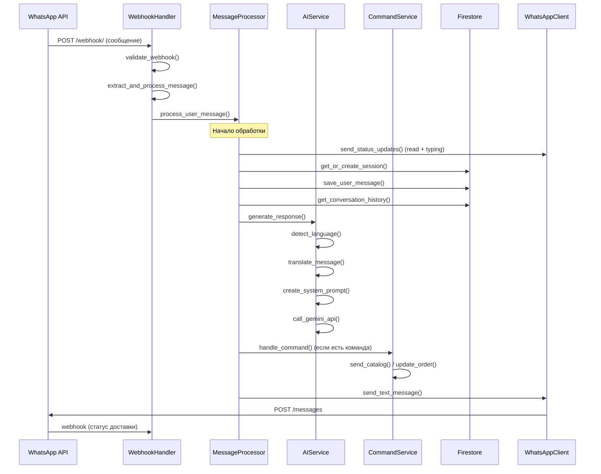

# Полный обзор системы AquaFlora WhatsApp Bot

## 🎯 Назначение системы

AquaFlora WhatsApp Bot - это интеллектуальный бот для цветочного магазина, который:
- Обрабатывает сообщения пользователей через WhatsApp Business API
- Использует AI (Gemini) для понимания намерений и генерации ответов
- Управляет заказами и каталогом товаров
- Поддерживает многоязычность (русский, английский, тайский)
- Интегрируется с внешними системами

## 🏗️ Архитектура системы

### Общая схема
```
┌─────────────────┐    ┌─────────────────┐    ┌─────────────────┐
│   WhatsApp      │    │   FastAPI       │    │   Google        │
│   Business API  │◄──►│   Application   │◄──►│   Services      │
└─────────────────┘    └─────────────────┘    └─────────────────┘
                              │                        │
                              ▼                        ▼
                       ┌─────────────────┐    ┌─────────────────┐
                       │   Firestore     │    │   Gemini AI     │
                       │   Database      │    │   API           │
                       └─────────────────┘    └─────────────────┘
```

### Компонентная архитектура
```
src/
├── main.py                    # Точка входа
├── app.py                     # FastAPI приложение
├── handlers/                  # Обработчики webhook'ов
│   ├── webhook_handler.py     # Основной обработчик
│   └── webhook_extractors.py  # Извлечение данных
├── services/                  # Бизнес-логика
│   ├── message_processor.py   # Центральный процессор
│   ├── ai_service.py         # Работа с AI
│   ├── command_service.py    # Обработка команд
│   ├── catalog_service.py    # Каталог товаров
│   ├── catalog_sender.py     # Отправка каталога
│   ├── session_service.py    # Управление сессиями
│   ├── order_service.py      # Управление заказами
│   └── message_service.py    # Работа с сообщениями
├── repositories/             # Слой доступа к данным
├── models/                   # Модели данных
└── utils/                    # Утилиты
```

## 🔄 Полная схема обработки сообщения

### 1. Получение webhook'а


### 2. Детальный поток обработки

#### Этап 1: Валидация и извлечение (50-100ms)
```python
# WebhookHandler.validate_webhook()
✅ Проверка структуры webhook
✅ Валидация типа сообщения
✅ Проверка дубликатов
✅ Валидация времени сообщения

# webhook_extractors.py
📤 Извлечение: sender_id, message_text, sender_name, wa_message_id, timestamp
```

#### Этап 2: Управление сессией (100-300ms)
```python
# SessionService.get_or_create_session_id()
🔄 Проверка существующей сессии в users/{sender_id}
⏰ Валидация срока сессии (неделя)
🆔 Генерация нового session_id при необходимости
💾 Сохранение в Firestore
```

#### Этап 3: Сохранение сообщения (200-500ms)
```python
# MessageService.add_message_with_transaction_sync()
🌍 Определение языка (AI + fallback)
🔄 Перевод на 3 языка (ru, en, th)
💾 Сохранение в conversations/{sender_id}/sessions/{session_id}/messages
🧹 Ограничение истории (10 сообщений)
```

#### Этап 4: AI обработка (3-8 секунд)
```python
# AIService.generate_response()
📚 Получение истории диалога (50 сообщений)
🎯 Создание системного промпта
🤖 Вызов Gemini API
📝 Парсинг JSON ответа
⚡ Извлечение текста и команд
```

#### Этап 5: Обработка команд (500ms-2 секунды)
```python
# CommandService.handle_command()
📋 send_catalog: отправка каталога
💾 save_order_info: сохранение данных заказа
➕ add_order_item: добавление товара
❌ remove_order_item: удаление товара
📦 update_order_delivery: обновление доставки
✅ confirm_order: подтверждение заказа
```

#### Этап 6: Отправка ответа (200-500ms)
```python
# MessageProcessor._send_ai_response()
💬 Создание сообщения AI
💾 Сохранение в БД
📤 Отправка через WhatsApp API
🔄 Повторные попытки при ошибках (до 3 раз)
```

## 📊 Структура базы данных

### Коллекции Firestore

#### 1. `users/{sender_id}`
```json
{
  "session_id": "20241201_143022_123456_789",
  "session_created": "2024-12-01T14:30:22Z",
  "name": "Иван",
  "language": "ru",
  "status": "active",
  "updated_at": "2024-12-01T14:30:22Z"
}
```

#### 2. `conversations/{sender_id}/sessions/{session_id}/messages/{message_id}`
```json
{
  "sender_id": "1234567890",
  "session_id": "20241201_143022_123456_789",
  "role": "user",
  "content": "Привет, покажите каталог",
  "content_en": "Hello, show me the catalog",
  "content_thai": "สวัสดี แสดงแคตตาล็อกให้ดู",
  "wa_message_id": "wamid.1234567890",
  "timestamp": "2024-12-01T14:30:22Z"
}
```

#### 3. `orders/{sender_id}/sessions/{session_id}`
```json
{
  "order_id": "20241201_143022_123456_789",
  "session_id": "20241201_143022_123456_789",
  "sender_id": "1234567890",
  "status": "draft",
  "date": "2024-12-02",
  "time": "15:00",
  "delivery_needed": true,
  "address": "ул. Пушкина, 10",
  "card_needed": true,
  "card_text": "С днем рождения!",
  "recipient_name": "Мария",
  "recipient_phone": "9876543210",
  "customer_name": "Иван",
  "customer_phone": "1234567890",
  "items": [
    {
      "product_id": "bouquet_001",
      "bouquet": "Роза красная",
      "quantity": 1,
      "price": "1500 руб",
      "notes": "С доставкой"
    }
  ],
  "created_at": "2024-12-01T14:30:22Z",
  "updated_at": "2024-12-01T14:35:15Z"
}
```

## 🤖 AI Система

### Модель: Gemini 2.5 Flash
```python
# Конфигурация
temperature: 0.7
top_p: 0.9
top_k: 40
max_output_tokens: 8192
safety_settings: отключены
```

### Системный промпт включает:
- Роль бота (консультант цветочного магазина)
- Язык пользователя
- Имя пользователя
- Информация о текущем заказе
- Инструкции по командам
- Каталог товаров (при необходимости)

### Поддерживаемые команды:
```python
SUPPORTED_COMMANDS = {
    'send_catalog',           # Отправка каталога
    'save_order_info',        # Сохранение данных заказа
    'add_order_item',         # Добавление товара
    'remove_order_item',      # Удаление товара
    'update_order_delivery',  # Обновление доставки
    'confirm_order',          # Подтверждение заказа
}
```

## 🌍 Многоязычность

### Поддерживаемые языки:
- **Русский** (ru) - основной
- **Английский** (en) - международный
- **Тайский** (th) - локальный

### Определение языка:
```python
# AIService.detect_language()
1. AI определение с оценкой уверенности
2. Fallback логика по символам и ключевым словам
3. Сохранение языка в сессии
4. Автоматический перевод всех сообщений
```

## 📈 Производительность

### Временные характеристики:
| Этап | Минимальное время | Максимальное время | Критичность |
|------|------------------|-------------------|-------------|
| Валидация webhook | 50ms | 100ms | Низкая |
| Извлечение данных | 10ms | 20ms | Низкая |
| Статусы WhatsApp | 200ms | 500ms | Средняя |
| Управление сессией | 100ms | 300ms | Средняя |
| Сохранение сообщения | 200ms | 500ms | Средняя |
| Получение истории | 100ms | 300ms | Средняя |
| **AI обработка** | **3s** | **8s** | **Высокая** |
| Обработка команд | 500ms | 2s | Средняя |
| Отправка ответа | 200ms | 500ms | Средняя |

### Общее время обработки:
- **Минимальное**: ~4.5 секунды
- **Максимальное**: ~12 секунд
- **Среднее**: ~8 секунд

### Bottlenecks:
1. **AI обработка** (Gemini API) - 40-70% времени
2. **Отправка каталога** - 20-40% времени
3. **Статусы WhatsApp** - 5-10% времени

## 🔧 Ключевые особенности

### 1. Управление сессиями
- Одна сессия = один заказ
- Автоматическое создание новых сессий
- Истечение сессий через неделю
- Команда `/newses` для сброса контекста

### 2. Работа с заказами
- Структурированное хранение в Firestore
- Поддержка множественных товаров
- Автоматическое создание при первом обращении
- Отслеживание статуса заказа

### 3. Интеграция с каталогом
- Получение товаров через WhatsApp Business API
- Валидация товаров перед добавлением в заказ
- Отправка каталога с изображениями
- Фильтрация по доступности

### 4. Логирование и мониторинг
- Подробное логирование всех операций
- Метрики обработки webhook'ов
- Отслеживание ошибок и дубликатов
- WABA Logger для детального анализа

### 5. Обработка ошибок
- Fallback сообщения при ошибках AI
- Повторные попытки отправки
- Graceful degradation при недоступности сервисов
- Кэширование обработанных сообщений

## 🚀 Оптимизации

### 1. Кэширование
```python
# Кэширование обработанных сообщений
_processed_messages = set()  # Предотвращение дублей

# Кэширование частых запросов
- Системные промпты
- Переводы
- Определения языка
```

### 2. Асинхронная обработка
```python
# Параллельное выполнение
- Отправка статусов (не блокирует основной поток)
- Сохранение в БД (асинхронно)
- Логирование (не блокирует)
```

### 3. Ограничения
```python
# Ограничение истории диалога
- 50 сообщений для AI
- 10 сообщений в БД на сессию
- Автоматическая очистка старых сообщений
```

## 🔒 Безопасность

### 1. Валидация данных
- Проверка структуры webhook'ов
- Валидация типов сообщений
- Проверка дубликатов
- Валидация времени сообщений

### 2. Ограничения доступа
- Правила безопасности Firestore
- Валидация sender_id
- Проверка прав доступа к данным

### 3. Обработка ошибок
- Graceful degradation
- Fallback сообщения
- Логирование ошибок
- Мониторинг критических операций

## 📊 Мониторинг

### Ключевые метрики:
```python
# Производительность
- Время обработки сообщений
- Количество ошибок
- Размер очереди
- Использование ресурсов

# Бизнес-метрики
- Количество пользователей
- Количество заказов
- Конверсия диалогов
- Популярность товаров
```

### Алерты:
```python
# Критические метрики
- Время ответа > 10 секунд
- Количество ошибок > 10%
- Размер очереди > 100
- Недоступность внешних API
```

## 🔄 Жизненный цикл сообщения

### Полный цикл:
1. **Получение** webhook'а от WhatsApp
2. **Валидация** структуры и данных
3. **Извлечение** ключевой информации
4. **Управление** сессией пользователя
5. **Сохранение** сообщения в БД
6. **Получение** истории диалога
7. **Обработка** через AI
8. **Выполнение** команд (если есть)
9. **Отправка** ответа пользователю
10. **Получение** статуса доставки

### Обработка ошибок на каждом этапе:
- Fallback логика
- Повторные попытки
- Логирование ошибок
- Graceful degradation

Эта архитектура обеспечивает надежную, масштабируемую и многоязычную обработку сообщений WhatsApp с интеграцией AI и управлением заказами. 