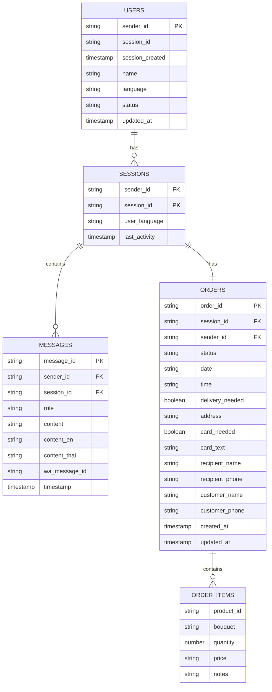

# Анализ схемы базы данных AquaFlora Bot

## Архитектура хранения данных

Система использует **Google Firestore** как основную базу данных с NoSQL архитектурой.

## Структура коллекций

### 1. Коллекция `users`
```
users/{sender_id}
├── session_id: string
├── session_created: timestamp
├── name: string
├── language: string
├── status: string
└── updated_at: timestamp
```

**Назначение:** Хранение основной информации о пользователях и их активных сессиях.

**Ключевые особенности:**
- `sender_id` - уникальный идентификатор пользователя (номер телефона)
- `session_id` - активная сессия пользователя
- `session_created` - время создания сессии (для валидации срока)
- Автоматическое создание при первом сообщении

### 2. Коллекция `conversations`
```
conversations/{sender_id}/sessions/{session_id}/messages/{message_id}
├── sender_id: string
├── session_id: string
├── role: string (user/assistant)
├── content: string
├── content_en: string
├── content_thai: string
├── wa_message_id: string
└── timestamp: timestamp
```

**Назначение:** Хранение истории диалогов пользователей.

**Структура:**
- Трехуровневая иерархия: пользователь → сессия → сообщения
- Каждое сообщение содержит переводы на 3 языка
- Ограничение: 10 последних сообщений на сессию
- Автоматическая очистка старых сообщений

### 3. Коллекция `orders`
```
orders/{sender_id}/sessions/{session_id}
├── order_id: string (равен session_id)
├── session_id: string
├── sender_id: string
├── status: string (draft/confirmed/completed/cancelled)
├── date: string
├── time: string
├── delivery_needed: boolean
├── address: string
├── card_needed: boolean
├── card_text: string
├── recipient_name: string
├── recipient_phone: string
├── customer_name: string
├── customer_phone: string
├── items: array[OrderItem]
├── created_at: timestamp
└── updated_at: timestamp
```

**Структура OrderItem:**
```json
{
  "product_id": "string",
  "bouquet": "string",
  "quantity": "number",
  "price": "string",
  "notes": "string"
}
```

**Назначение:** Управление заказами пользователей.

**Ключевые особенности:**
- Один заказ на сессию
- Поддержка множественных товаров
- Автоматическое создание при первом обращении
- Отслеживание статуса заказа

### 4. Коллекция `errors` (опционально)
```
errors/{error_id}
├── error_type: string
├── message: string
├── stack_trace: string
├── context: object
├── sender_id: string
├── session_id: string
└── timestamp: timestamp
```

**Назначение:** Логирование ошибок для отладки и мониторинга.

## Схема связей



## Операции с данными

### 1. Создание пользователя
```python
# При первом сообщении
users/{sender_id}.set({
    'session_id': generated_session_id,
    'session_created': SERVER_TIMESTAMP,
    'name': sender_name,
    'updated_at': SERVER_TIMESTAMP
})
```

### 2. Создание сессии
```python
# Автоматически при обращении к session_id
conversations/{sender_id}/sessions/{session_id}.set({
    'user_language': detected_language,
    'last_activity': SERVER_TIMESTAMP
})
```

### 3. Сохранение сообщения
```python
# С транзакцией для ограничения истории
conversations/{sender_id}/sessions/{session_id}/messages/{message_id}.set({
    'sender_id': sender_id,
    'session_id': session_id,
    'role': 'user' | 'assistant',
    'content': message_text,
    'content_en': translated_en,
    'content_thai': translated_thai,
    'wa_message_id': wa_message_id,
    'timestamp': SERVER_TIMESTAMP
})
```

### 4. Создание заказа
```python
# При первом обращении к заказу
orders/{sender_id}/sessions/{session_id}.set({
    'order_id': session_id,
    'session_id': session_id,
    'sender_id': sender_id,
    'status': 'draft',
    'items': [],
    'created_at': SERVER_TIMESTAMP,
    'updated_at': SERVER_TIMESTAMP
})
```

### 5. Обновление заказа
```python
# Добавление товара
orders/{sender_id}/sessions/{session_id}.update({
    'items': firestore.ArrayUnion([new_item]),
    'updated_at': SERVER_TIMESTAMP
})
```

## Индексы и оптимизация

### Рекомендуемые индексы:
```javascript
// Для быстрого поиска сообщений
conversations/{sender_id}/sessions/{session_id}/messages
- timestamp (descending)

// Для поиска заказов по статусу
orders/{sender_id}/sessions/{session_id}
- status (ascending)
- created_at (descending)

// Для поиска пользователей по активности
users
- session_created (descending)
- updated_at (descending)
```

### Ограничения и правила:
```javascript
// Ограничение количества сообщений
// Автоматическое удаление старых сообщений
// Максимум 10 сообщений на сессию

// Валидация данных
// Обязательные поля для заказов
// Формат session_id
```

## Паттерны доступа к данным

### 1. Чтение истории диалога
```python
# Получение последних 50 сообщений для AI
messages_ref = db.collection('conversations').document(sender_id)\
    .collection('sessions').document(session_id)\
    .collection('messages')\
    .order_by('timestamp', direction=firestore.Query.DESCENDING)\
    .limit(50)
```

### 2. Получение активной сессии
```python
# Проверка существующей сессии
user_doc = db.collection('users').document(sender_id).get()
if user_doc.exists:
    session_id = user_doc.get('session_id')
    session_created = user_doc.get('session_created')
    # Проверка срока действия
```

### 3. Обновление заказа
```python
# Транзакционное обновление
@firestore.transactional
def update_order_transaction(transaction, order_ref, new_data):
    order_doc = order_ref.get(transaction=transaction)
    if order_doc.exists:
        transaction.update(order_ref, new_data)
```

## Мониторинг и метрики

### Ключевые метрики:
```python
# Размер данных
- Количество пользователей
- Количество активных сессий
- Размер истории диалогов
- Количество заказов

# Производительность
- Время чтения/записи
- Количество транзакций
- Размер документов
- Частота обращений
```

### Алерты:
```python
# Критические метрики
- Размер коллекции messages > 1000
- Время ответа БД > 1 секунда
- Количество ошибок транзакций > 10%
- Размер документа > 1MB
```

## Резервное копирование и восстановление

### Стратегия бэкапов:
```python
# Автоматические бэкапы Firestore
- Ежедневные полные бэкапы
- Почасовые инкрементальные бэкапы
- Хранение 30 дней

# Экспорт данных
- JSON экспорт для анализа
- CSV экспорт для отчетов
- Архивирование старых данных
```

## Безопасность

### Правила безопасности Firestore:
```javascript
rules_version = '2';
service cloud.firestore {
  match /databases/{database}/documents {
    // Пользователи могут читать только свои данные
    match /users/{userId} {
      allow read, write: if request.auth != null && request.auth.uid == userId;
    }
    
    // Сообщения доступны только владельцу
    match /conversations/{userId}/sessions/{sessionId}/messages/{messageId} {
      allow read, write: if request.auth != null && request.auth.uid == userId;
    }
    
    // Заказы доступны только владельцу
    match /orders/{userId}/sessions/{sessionId} {
      allow read, write: if request.auth != null && request.auth.uid == userId;
    }
  }
}
```

## Масштабирование

### Стратегии масштабирования:
```python
# Горизонтальное масштабирование
- Шардинг по sender_id
- Репликация для чтения
- Кэширование частых запросов

# Вертикальное масштабирование
- Увеличение лимитов Firestore
- Оптимизация запросов
- Индексирование данных
```

Эта схема обеспечивает эффективное хранение и быстрый доступ к данным для WhatsApp бота с поддержкой многоязычности и управления заказами. 