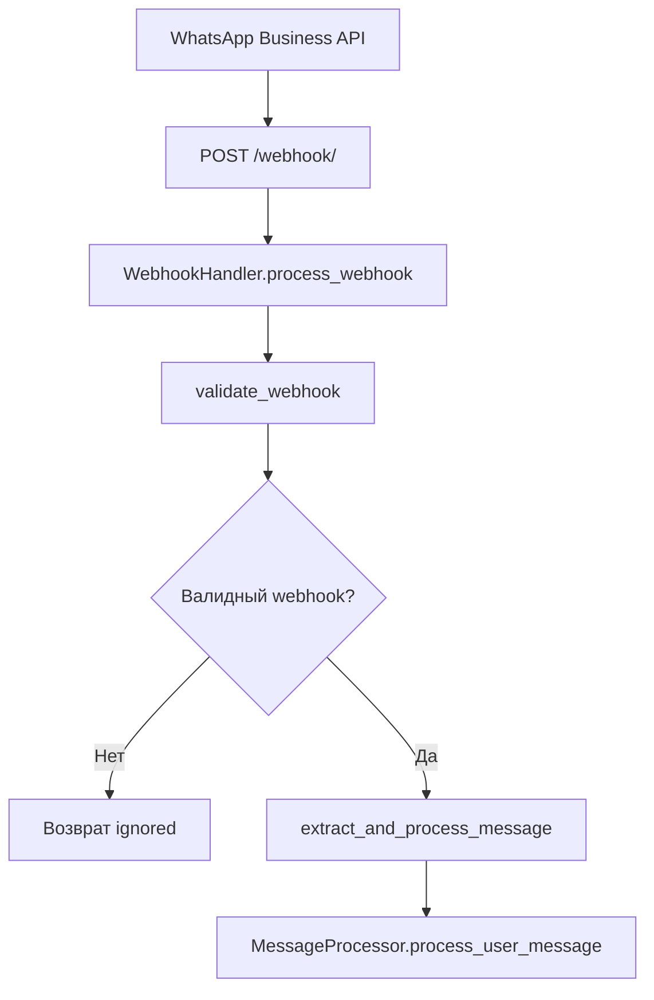
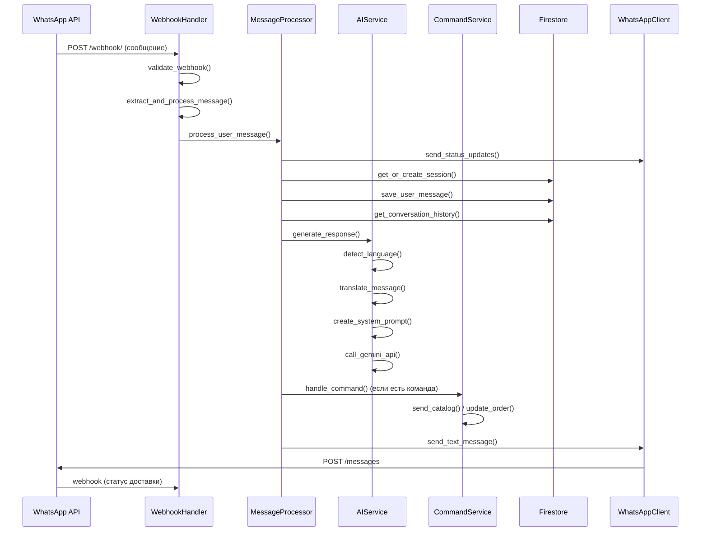

# Глубокий анализ системы AquaFlora WhatsApp Bot

## Архитектура системы

### Основные компоненты

```
src/
├── main.py                 # Точка входа FastAPI приложения
├── app.py                  # Создание и настройка FastAPI приложения
├── handlers/               # Обработчики webhook'ов
│   ├── webhook_handler.py  # Основной обработчик webhook'ов от WhatsApp
│   └── webhook_extractors.py # Извлечение данных из webhook'ов
├── services/               # Бизнес-логика
│   ├── message_processor.py # Центральный процессор сообщений
│   ├── ai_service.py       # Работа с AI (Gemini)
│   ├── command_service.py  # Обработка команд от AI
│   ├── catalog_service.py  # Работа с каталогом товаров
│   ├── catalog_sender.py   # Отправка каталога
│   ├── session_service.py  # Управление сессиями
│   ├── order_service.py    # Управление заказами
│   └── message_service.py  # Работа с сообщениями
├── repositories/           # Слой доступа к данным
├── models/                 # Модели данных
└── utils/                  # Утилиты
```

## Подробная схема обработки сообщения от пользователя

### 1. Получение webhook'а от WhatsApp Business API

**Эндпоинт:** `POST /webhook/` или `POST /webhook`

**Компонент:** `WebhookHandler.process_webhook()`



### 2. Валидация и извлечение данных

**Компонент:** `WebhookHandler.validate_webhook()`

```python
# Проверки:
1. Структура webhook (entry -> changes -> value)
2. Тип контента (statuses или messages)
3. Дубликаты сообщений (кэш _processed_messages)
4. Поддерживаемые типы сообщений (text, interactive, image, etc.)
```

**Компонент:** `webhook_extractors.py`

```python
# Извлекаемые данные:
- sender_id (ID пользователя)
- message_text (текст сообщения)
- sender_name (имя пользователя)
- message_type (тип сообщения)
- wa_message_id (ID сообщения WhatsApp)
- timestamp (время сообщения)
```

### 3. Основная обработка сообщения

**Компонент:** `MessageProcessor.process_user_message()`

#### 3.1 Отправка статусов
```python
# Отправляем статусы WhatsApp:
1. "read" - сообщение прочитано
2. "typing" - бот печатает
```

#### 3.2 Управление сессией и пользователем
```python
# SessionService.get_or_create_session_id():
1. Проверяем существующую сессию в users/{sender_id}
2. Если сессия старше недели - создаем новую
3. Генерируем session_id: "YYYYMMDD_HHMMSS_microseconds_random"

# UserService:
1. Создаем пользователя если не существует
2. Сохраняем имя и телефон в заказ
```

#### 3.3 Специальные команды
```python
# Обработка команды /newses:
1. Создание новой сессии
2. Сброс контекста диалога
3. Приветственное сообщение
```

#### 3.4 Сохранение сообщения пользователя
```python
# MessageService.add_message_with_transaction_sync():
1. Определение языка пользователя (AI + fallback)
2. Перевод сообщения на 3 языка (ru, en, th)
3. Сохранение в Firestore: conversations/{sender_id}/sessions/{session_id}/messages
4. Ограничение истории (10 последних сообщений)
```

### 4. Обработка через AI

**Компонент:** `AIService.generate_response()`

#### 4.1 Подготовка контекста
```python
# Получение истории диалога:
1. MessageService.get_conversation_history_for_ai_by_sender()
2. Ограничение: 50 последних сообщений
3. Форматирование для AI с учетом ролей (user/assistant)
```

#### 4.2 Системный промпт
```python
# Динамический промпт включает:
1. Роль бота (консультант цветочного магазина)
2. Язык пользователя
3. Имя пользователя
4. Информация о заказе (если есть)
4. Инструкции по командам
5. Каталог товаров (если нужен)
```

#### 4.3 Генерация ответа
```python
# Gemini 2.5 Flash:
1. Temperature: 0.7
2. Max tokens: 8192
3. Безопасность: отключена
4. Формат ответа: JSON с текстом и командами
```

### 5. Обработка команд от AI

**Компонент:** `CommandService.handle_command()`

#### Поддерживаемые команды:
```python
SUPPORTED_COMMANDS = {
    'send_catalog',           # Отправка каталога
    'save_order_info',        # Сохранение данных заказа
    'add_order_item',         # Добавление товара
    'remove_order_item',      # Удаление товара
    'update_order_delivery',  # Обновление доставки
    'confirm_order',          # Подтверждение заказа
}
```

#### 5.1 Отправка каталога
```python
# CatalogSender.send_catalog():
1. Получение доступных товаров из каталога
2. Отправка каждого товара отдельным сообщением
3. Формат: изображение + название + цена
4. Сохранение в историю диалога
```

#### 5.2 Управление заказом
```python
# OrderService:
1. Структура: orders/{sender_id}/sessions/{session_id}
2. Один заказ на сессию
3. Поддержка множественных товаров
4. Автоматическое создание при первом обращении
```

### 6. Отправка ответа пользователю

**Компонент:** `MessageProcessor._send_ai_response()`

#### 6.1 Подготовка ответа
```python
# Создание сообщения AI:
1. Текст на языке пользователя
2. Переводы на en/th
3. Сохранение в БД
4. Отправка через WhatsApp API
```

#### 6.2 Обработка ошибок
```python
# Fallback сообщения:
1. Ошибка AI -> стандартные ответы
2. Ошибка отправки -> повторные попытки (3 раза)
3. Критическая ошибка -> сообщение об ошибке
```

## Поток данных

### Полный цикл обработки:



## Ключевые особенности системы

### 1. Многоязычность
- Автоматическое определение языка (AI + fallback)
- Перевод всех сообщений на 3 языка (ru, en, th)
- Сохранение языка в сессии

### 2. Управление сессиями
- Одна сессия = один заказ
- Автоматическое создание новых сессий
- Истечение сессий через неделю

### 3. Работа с заказами
- Структурированное хранение в Firestore
- Поддержка множественных товаров
- Автоматическое обновление статусов

### 4. Интеграция с каталогом
- Получение товаров через WhatsApp Business API
- Валидация товаров перед добавлением в заказ
- Отправка каталога с изображениями

### 5. Логирование и мониторинг
- Подробное логирование всех операций
- Метрики обработки webhook'ов
- Отслеживание ошибок и дубликатов

### 6. Обработка ошибок
- Fallback сообщения при ошибках AI
- Повторные попытки отправки
- Graceful degradation при недоступности сервисов

## Производительность и масштабируемость

### Оптимизации:
1. Кэширование обработанных сообщений (предотвращение дублей)
2. Ограничение истории диалога (50 сообщений для AI)
3. Асинхронная обработка всех операций
4. Batch операции с Firestore

### Мониторинг:
1. Метрики webhook'ов
2. Время обработки сообщений
3. Успешность отправки
4. Ошибки AI и внешних API

Эта архитектура обеспечивает надежную, масштабируемую и многоязычную обработку сообщений WhatsApp с интеграцией AI и управлением заказами. 